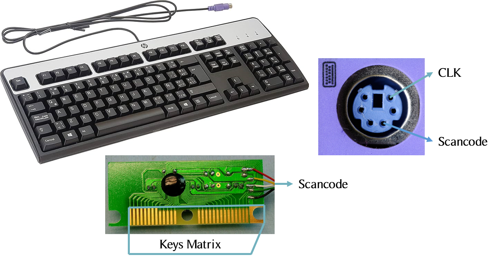
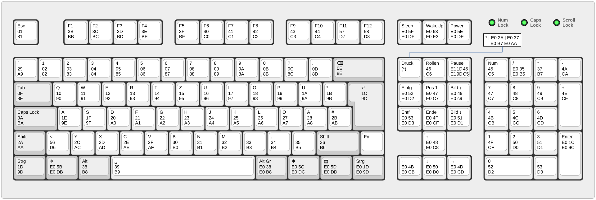
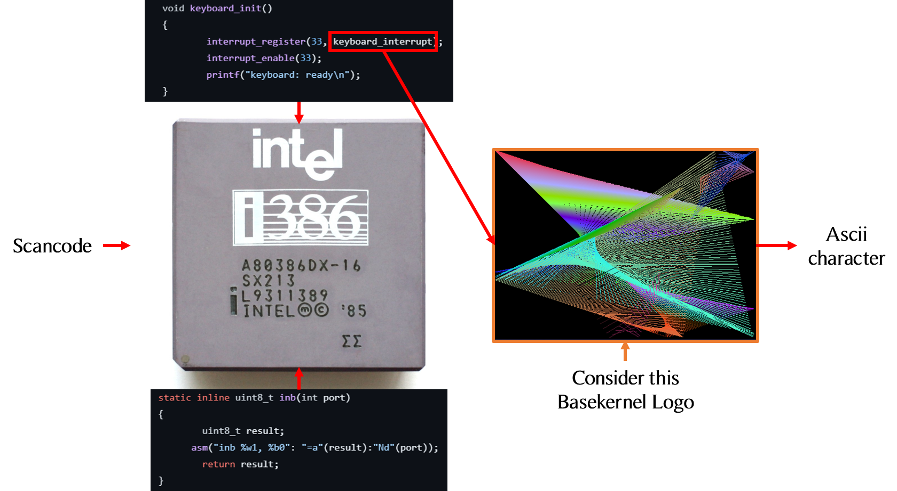
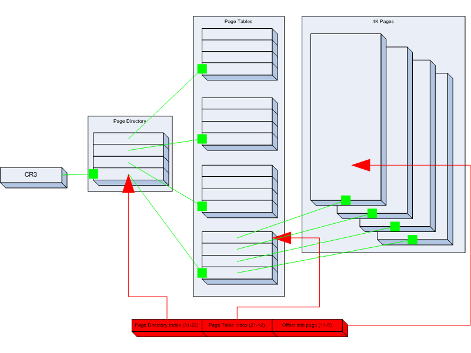

<h1 align="center" style="font-family: Georgia, serif;">CHANGES IN keyboard.c</h1>

This section focuses on the changes and additions to keyboard.c and other related files that manage PS/2 keyboard input. The goal is to facilitate the inclusion of a user-defined keymap alongside the one already provided. Although it may seem simple, this process requires knowledge of specific concepts. While some may argue that the PS/2 standard is obsolete, it's important to note that the code and algorithms provided can be adapted with a few changes to be compatible with HID USB keyboards. So, bear with the guide and enjoy the ride!

# PS/2 Keyboards in 100 seconds

Every keyboard (even a remote control keyboard) arranges all the physical keys in a matrix to make the circuits more compact. You can see a quick example in [Reference 1]. The keyboard controller is responsible for converting the key matrix signal into a meaningful signal; in our case, with a PS/2 keyboard, we call it a scancode.

  

This scancode is sandwiched between a start bit and a parity bit before the stop bit. Note that PS/2 keyboards were designed by IBM in 1987; however, their 1983 systems were already made to support them. Each key has a specific attributed scancode. In 1983, IBM introduced a specific set known as scancode set 1. In 1984, they released an updated version that was widely used, called scancode set 2. There is also a niche scancode set 3 that is rarely used. In any case, [Reference 2] contains all three scancode sets.

  

Basekernel supports scancode set 1, which is thankfully the easiest to work with. Before continuing, let me mention that a scancode is an 8-bit string where the most significant bit indicates whether the key is pressed or released. This allows for the mapping of 128 keys, which is not sufficient. IBM anticipated this issue and reserved the scancode E0 as a prefix for extra keys. For example, pressing the key "8" on your numpad generates the scancode 0x48, while pressing the "up arrow" key generates the scancode 0xE0 followed by 0x48. Systems that are not designed to support the "up arrow" key will ignore both E0 and the subsequent scancode, preventing it from being misinterpreted as "8." To gain a clearer understanding, check the 23:54 timestamp of [Reference 3] along with the protocol section of [Reference 4].

  

Now that we have that out of the way, let's focus on what matters. The task of the OS is to retrieve the scancodes sent by the keyboard and convert them into something meaningful or easier to work with. In our case, we will convert the scancodes primarily to ASCII characters. So, in technical terms, when a user presses "q," our OS is responsible for taking its scancode, 0x10 (in scancode set 1), and converting it to 113, which is the ASCII code for "q," and so on. One note is that Basekernel has provided support for only four extra keys, which are the arrow keys.

# Keyboards in Basekernel
## What we are dealing with

The `keyboard.c` file contains three functions: `keyboard_init()`, which enables interrupt signal 33 and attaches to `keyboard_interrupt()`. As a result, upon pressing any key, this function will be automatically called. The `keyboard_interrupt()` function only handles the processing of the four extra keys and adapts them so they can be sent in an appropriate form to `keyboard_interrupt_l2()`, which is primarily meant for handling all other keys and their subsequent modifiers like Shift, Ctrl, and Alt.

The genius of `keyboard_interrupt_l2()` is that it uses an array called `keymap`. The received scancode is used as an index; for example, for an alphanumeric key, keymap[scancode] will give us the associated ASCII character for the key pressed after the necessary processing, which you can easily understand thanks to [Reference 2] and [Reference 5].

## What we brought and modified

This brings us to the changes, which include the addition of the `keymap` array in its own separate file, `keymap.c`, to allow toggling between different `keymaps`: the already provided QWERTY and the AZERTY one we added, `keymap.fr.pc.c`. We also extended the `keymap` struct to include characters accessed by the Alt modifier, which are typically found on French AZERTY keyboards. This change makes it much easier for anyone to create their own `keymap` for any regional keyboard, as long as they modify `kshell.c` and change the sections from lines 236 to 258 by simply adding an if statement that requires only basic pattern recognition.

These changes and the accompanying guide will not only provide support for different `keymaps` but will also equip you with the knowledge needed to recognize and address keyboard handling (especially for PS/2) in any OS source code, regardless of its size. Checking [Reference 6] will also be helpful for dealing with HID USB keyboards, keeping in mind that they are not interrupt-based like PS/2 but rather rely on a polling principle.

# References
Reference 1: <a href="https://youtube.com/shorts/SJJU6slRozk?si=1oLyI31qDhUoRLdp">Key Matrix</a> 
Reference 2: <a href="https://de.wikibooks.org/wiki/C-Programmierung_mit_AVR-GCC:_GPIO_Pins:_Projekt-1">The 3 scancode sets</a> 
Reference 3: <a href="https://youtu.be/7aXbh9VUB3U?si=dORj6p-YP_Lolrfq">Remember the timestamp 23:54</a> 
Reference 4: <a href="https://de.wikipedia.org/wiki/PS/2-Schnittstelle">PS/2 interface</a> 
Reference 5: <a href="https://wiki.osdev.org/PS/2_Keyboard">PS/2 Keyboard</a> 
Reference 6: <a href="https://files.microscan.com/helpfiles/ms4_help_file/ms-4_help-02-46.html">Your Startpoint if you want to support USB HID keyboards</a> 

<h1 align="center" style="font-family: Georgia, serif;">WHAT'S DIFFERENT IN THE MEMORY MANAGEMENT SECTION</h1>

  

# So what are the actual differences
In the memory management section of our OS, our main objective was to enhance code clarity and readability while ensuring the memory management remains fully functional. We aim to create code that is intuitive and easy for any developer to follow. To accomplish this, we focused on refining the `page.c` and `pagetable.c` files with specific improvements.
# `Page` Management Code Changes
## Overview
`page.c` has been enhanced with Memory Corruption Detection, Enhanced Boundary Checks, Error Handling and Reporting, and Logging, as detailed below:
## Memory Corruption Detection

Memory corruption occurs when a program unintentionally modifies memory, leading to unpredictable behavior or security vulnerabilities. To detect memory corruption, this system uses a **guard pattern** (`GUARD_PATTERN`) during both page allocation and deallocation.

- **During Allocation (`page_alloc`)**: Before allocating a page, the system checks if the memory at the target address matches the guard pattern. If it does, an error is logged, and the allocation is aborted, as this indicates potential memory corruption.
- **During Deallocation (`page_free`)**: When a page is freed, the system checks the memory for the guard pattern again. If detected, an error is logged, signaling possible memory corruption.

This detection mechanism helps catch issues like buffer overflows or unintended memory modifications, improving the security and reliability of the system.

## Enhanced Boundary Checks

Boundary checks ensure that memory accesses stay within valid bounds, preventing out-of-bounds errors that could lead to crashes or undefined behavior.

- **During Allocation (`page_alloc`)**: After identifying a free page, the system checks if the page number is within valid memory limits. If it exceeds the bounds, an error is logged, and the operation is aborted.
- **During Deallocation (`page_free`)**: The system checks if the address being freed is within the valid memory range and properly aligned. If the address is invalid, an error is logged, and the deallocation is halted.

These checks prevent memory access violations, ensuring the stability and safety of the memory management system.

## Error Handling and Reporting

The system integrates robust error handling and reporting mechanisms to ensure that issues are detected and addressed promptly.

- **Error Reporting**: The system uses a logging mechanism to report errors at different severity levels:
  - **Warnings** for non-critical issues that may indicate potential problems (e.g., memory overcommitment).
  - **Errors** for critical issues that require immediate attention (e.g., memory corruption, invalid operations).
  
- **Handling Initialization**: Functions like `page_alloc` and `page_free` include checks to ensure that the memory management system is initialized before performing operations. If the system is not initialized, an error is logged, and the operation is prevented.

These mechanisms ensure that the system remains stable and that problems are identified and resolved quickly.

## Reporting and Logging

Logging is essential for tracking the behavior of the memory management system and diagnosing issues.

- **Logging Mechanism**: The system uses a `LOG` macro to log messages at various levels, including informational messages during initialization, warnings for potential issues, and errors for critical failures.
- **Detailed Logging**: Logs capture details such as the total memory available, the number of free pages, and specific errors like invalid page addresses or memory corruption.

These logs are invaluable for understanding system behavior, troubleshooting issues, and maintaining system stability.

# `Page_Table` Management Code Changes

## Overview

The following section details the enhancements made to the `page_table` management code, focusing on improvements in privilege escalation protection, input validation, overflow and bounds checking, return code management, and the implementation of more comprehensive logging.
## Code Changes and Explanations

### 1. Logging Improvements

**Added Logging for Error Handling:**

- **Overview:** Integrated a logging mechanism to provide visibility into the code's execution and to capture significant events and errors.
- **How It Works:** A logging header file was included, and various parts of the code were updated to use logging macros. This helps track errors, warnings, and other important information during execution.

### 2. Input Validation

**Added Address Validation Function:**

- **Overview:** Implemented a function to validate addresses and ensure they fall within acceptable bounds.
- **How It Works:** Before performing operations on addresses, the new validation function checks if the address exceeds the maximum allowed limit. If it does, an error is logged, and appropriate actions are taken to prevent invalid operations.

### 3. Overflow and Bounds Checking

**Ensured Memory Limits and Address Validations:**

- **Overview:** Added checks to ensure that memory operations do not exceed allocated bounds and handle potential overflows.
- **How It Works:** Functions that perform operations on memory and addresses were updated to include checks for memory limits and address boundaries. This prevents invalid access and potential corruption of memory.

### 4. Privilege Escalation Handling

**Checked for Unauthorized Access:**

- **Overview:** Added checks to prevent privilege escalation by verifying if kernel-level operations are improperly applied to user-mode pages.
- **How It Works:** During operations such as page mapping, the code now checks for attempts to escalate privileges inappropriately. If such an attempt is detected, an error is logged, and the operation is handled accordingly.

### 5. Return Codes

**Enhanced Error Handling with Return Codes:**

- **Overview:** Improved error handling by introducing return codes to indicate success or failure of operations.
- **How It Works:** Functions now return specific error codes to represent different types of failures or successes. This allows the caller to handle errors more effectively and ensures that the code can respond to issues in a controlled manner.

### 6. Verbose Logging

**Added Verbose Logging Statements:**

- **Overview:** Enhanced visibility into the code’s operation by adding detailed logging statements.
- **How It Works:** Various functions were updated to include logging statements that provide insights into their execution, including error conditions and important status changes. This helps in debugging and understanding the code’s behavior during runtime.

## Conclusion

The modifications improve the robustness and reliability of the page table management code by incorporating detailed logging, input validation, overflow and bounds checking, privilege escalation prevention, and enhanced error handling with return codes.

# Memory management
## Paging

  

Paging is a memory management scheme that eliminates the need for contiguous allocation of physical memory. This allows the physical address space of a process to be noncontiguous, making efficient use of available memory.
### Paging in simple terms:
Paging breaks down memory into fixed-size blocks called "pages" for the process's logical memory, and into blocks of the same size called "frames" for the physical memory. When a process is to be executed, its pages are loaded into any available memory frames from the disk.
### Key Concepts
- **Page:** A fixed-length contiguous block of virtual memory.
- **Frame:** A fixed-length block of physical memory, of the same size as a page.
- **Page Table:** A data structure used by the operating system to keep track of the mapping between virtual addresses and physical addresses.
### Illustration of Paging
            Logical Address Space          Physical Address Space
         +------------------------+       +------------------------+
         | Page 0 | Page 1 | ...  |       | Frame 0| Frame 1| ...  |
         +--------+--------+----- +       +--------+--------+------+
         |        |        |      |       |        |        |      |
         |  Data  |  Data  | ...  |       |  Data  |  Data  | ...  |
         |        |        |      |       |        |        |      |
         +--------+--------+------+       +--------+--------+------+

           Logical Address Space:                   Page Table:
         +--------+--------+------+       +-------------+--------------+
         | Page 0 | Page 1 | ...  |       | Page Number | Frame Number |
         +--------+--------+------+       +-------------+--------------+
         |        |        |      |       | Page 0      | Frame 2      |
         |  Data  |  Data  | ...  |       | Page 1      | Frame 4      |
         |        |        |      |       | Page 2      | Frame 5      |
         +--------+--------+------+       +-------------+--------------+

### Memory Management Diagram

    +---------------+          +---------------+           +----------------+           +---------------+           +---------------+           +---------------+           +---------------+
    |               |          |               |           |                |           |               |           |               |           |               |           |               |
    |   Process     |   --->   |  Memory       |   --->    |  Paging        |   --->    |  Page Table   |   --->    |  Page Table   |   --->    |  Physical     |   --->    |  Page Presence|
    |  (Virtual     |          |  Management   |           |  Directory     |           |  (PT)         |           |  Entry (PTE)  |           |  Memory       |           |  Bit (PPB)    |
    |   Address     |          |  Unit (MMU)   |           |  (PD)          |           |               |           |               |           |  (RAM)        |           |               |
    |   Space)      |          |  (Translation |           |  (Contains     |           |  (Contains    |           |  (Contains    |           |  (Divided into|           |  (Indicates   |
    |               |          |   of Virtual  |           |   1024 4-byte  |           |   1024 4-byte |           |   Page Frame  |           |   4 KiB Page  |           |   whether the |
    |               |          |   Address)    |           |   entries,     |           |   entries,    |           |   Number,     |           |   Frames)     |           |   page is in  |
    |               |          |               |           |   each pointing|           |   each pointing|          |   Page Status,|           |               |           |   physical    |
    |               |          |               |           |   to a Page    |           |   to a 4 KiB  |           |   Access      |           |               |           |   memory)     |
    +---------------+          +---------------+           |   table)       |           |   Physical    |           |   Control,    |           +---------------+           +---------------+
                                                           |                |           |   Page Frame) |           |   Cache       |                                                |
                                                           +----------------+           +---------------+           |   Control)    |                                                |
                                                                                                                    +---------------+                                                |
             ________________________________________________________________________________________________________________________________________________________________________|
            |
           \_/ 
    +---------------+          +---------------+           +---------------+           +---------------+           +----------------+           
    |               |          |               |           |               |           |               |           |                |         
    |  Page Fault   |   --->   |  Page Fault   |   --->    |  Page         |   --->    |  Disk         |   --->    |  Disk I/O      |       
    |  (Trap to     |          |  Handler      |           |  Replacement  |           |  Storage      |           |  (Read/Write)  |       
    |   Operating   |          |  (Determines  |           |  Algorithm    |           |  (Hard Drive) |           |                |       
    |   System)     |          |   cause of    |           |  (Selects     |           |  (Stores      |           |  (Reads page   |        
    |               |          |   page fault, |           |   victim page |           |   pages that  |           |   from disk    |         
    |               |          |   selects     |           |   to replace) |           |   are not in  |           |   storage into |          
    |               |          |   replacement |           |               |           |   physical    |           |   physical     |        
    |               |          |   page)       |           |               |           |   memory)     |           |   memory, or   |       
    +---------------+          +---------------+           +---------------+           +---------------+           |   writes page  |         
                                                                                                                   |   from physical|
                                                                                                                   |   memory to    |
                                                                                                                   |   disk storage |
                                                                                                                   +----------------+
                                                                                                                             |
                                                                                                                             |
             ________________________________________________________________________________________________________________|
            |
           \_/ 
    +---------------+           +---------------+
    |               |           |               |
    |  Page Table   |   --->    |  Process      |
    |  Update       |           |  (Continued)  |
    |  (Updates     |           |  (Resumes     |
    |   page table  |           |   execution   |
    |   entry to    |           |   with updated|
    |   reflect new |           |   page table) |
    |   mapping of  |           |               |
    |   virtual page|           |               |
    |   to physical |           |               |
    |   page)       |           |               |
    +---------------+           +---------------+

# Bootblock

In the original code, we can see that bios interrupts are called without being followed by carry jumps in case of an error, we fixed that!

## Bootscreen

This section focuses on the changes and additions to bootblock.S. Added two bootsceens: The first one displays "Basekernel" and gives credits to Douglas Thain, the creator of basekernel. The second one credits us, after modifying and inhancing the OS.

## Error Handling

//to be competed

# Process Handling

The processes have unique identification numbers or IDs unique to said process nad used to manage it, changing it's state for example (waiting/running/stopped...). In basekernel it is done using various function, notably `process_create` `process_allocate_pid` `process_delete` `process_reap`.

## Process Management

-Added a process spawner function ('init')
-Added the ability to show process's ID 
-Optimized the process ID allocation to be more efficient in the case of a deleted process.

Let's brreak down the last bullet point. In the case where a process isn't deleted, Dthain's algorithm is the that is working to look for a free PID to allocate. It goes as follows :

<h3 align="center" style="font-family: Georgia, serif;">schematic 1</h3>

The program first loops from the last used pid to `PROCESS_MAX_PID`, which is 1024 in this configuration, then it gives the variable `last` the value of the next PID in case it was free. Once that PID is found, it loops from `1` to `last` looking for a free PID. This time, when that PID is foudn, it's the one returned by `process_alocate_pid` and is then used by `process_create` to create a process with said PID. 

Why start from `1`? The process with the ID=`0` is the parent process, all created processes inherit from this one.

<h3 align="center" style="font-family: Georgia, serif;">schematic 2</h3>

Our optimisation targets the case where a process is deleted. When a process gets deleted by the functions `process_delete` and `process_reap`, it's 100% sure to be free. And so when a process gets deleted, instead of looping, the next process to get created gets the PID of it's predecessor.

# KShell Utilities 

-Added a history to the kernel shell commands allowing the user to go through them using the up and down arrow keys.
-Updated the `help`command.

## KShell Commands

-Added the following commands:
- `kb_layout` : changes the keyboard language layout and displays the available ones. (currently supports en-US and fr-FR). The argument `help` provides the available commands as well as some arguments.
- `process_show` : displays all the running processes' IDs

## Conclusion
Paging is a critical concept in modern operating systems that helps manage memory efficiently by breaking logical memory into fixed-size pages and mapping them to physical frames.
